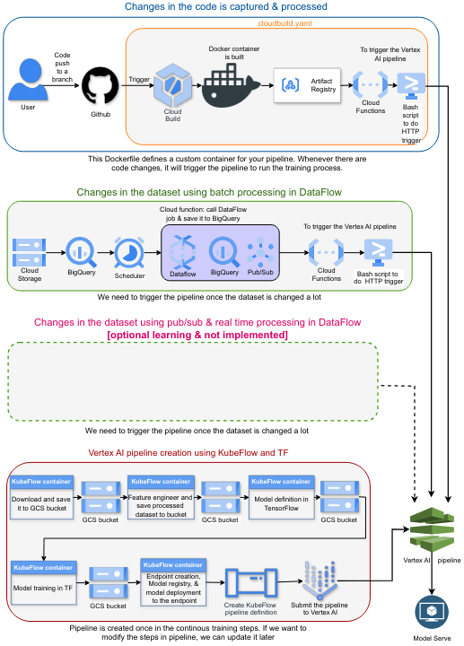

## Continous Training Architecture
Continuous training means that the ML system automatically and continuously retrains machine learning models to adapt to changes in the data before it is redeployed. Possible triggers for rebuilding include data changes, model changes, or code changes[1].

In this repo, we demonstrate contonous training from both code and data changes.

## Manual Cloud Functions setup
Look at the instruction 

### Reference
1. https://docs.aws.amazon.com/prescriptive-guidance/latest/mlops-checklist/training.html#:~:text=Continuous%20training%20means%20that%20the,model%20changes%2C%20or%20code%20changes.

