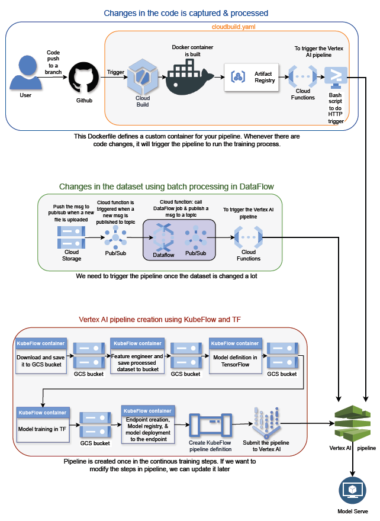

## Continous Training Architecture
Continuous training means that the ML system automatically and continuously retrains machine learning models to adapt to changes in the data before it is redeployed. Possible triggers for rebuilding include data changes, model changes, or code changes[1].




In this repo, we demonstrate continous training from both code and data changes.

## Cloud Functions
There are two ways to create cloud functions. The one is though cloud build which I will explain here and the second method is by creating it manually through Cloud Functions page (you can see the instruction at "Manual Cloud Functions setup")

### Cloud Functions setup through Cloud Build
1. Create main.py and requirements.txt files as described in ManualCloudFunctions.md
2. Create a zip file and upload to the GCS bucket and add the location of it to the '--source' section in the cloudbuild.yaml file as shown in the next step.
3. Add below code to cloudbuild.yaml file
```
  # Creating Cloud Functions
  - name: gcr.io/google.com/cloudsdktool/cloud-sdk
    args:
      - gcloud
      - functions
      - deploy
      - 'cloudbuild_mnist_vertex_pipeline_cloudfunction' # function name in the main.py
      - '--region'
      - 'us-central1'
      - '--source'
      - 'gs://mlops-heavy-workflow-bucket/cloud_functions/cloudbuild_mnist_vertex_pipeline_cloudfunction.zip' # it has to be stored as zip file with main.py and requirements.txt
      - '--trigger-http'
      - '--gen2'
      - '--allow-unauthenticated'
      - '--runtime'
      - 'python312'
      - '--memory'
      - '512M'
```
4. This will create the cloud functions

### Trigger the Cloud Functions from Cloud Build
1. Once the cloud function is deployed, the http-trigger based cloud functions will have url which can be used to trigger the Cloud Functions by invoking it.
2. Getting this url is a manual proccess in the first stage, but squbsequent updates can execute automatically by adding this static url to our bash script to invoke it
3. We can add the following code to cloudbuild.yaml to automate the triggering of Cloud Functions once we have the url from the deployed Cloud function.
```
 - name: gcr.io/cloud-builders/gcloud
    entrypoint: "bash"
    args:
      - "-c"
      - |
          RESPONSE=$(curl -i https://us-central1-mlops-heavy-workflow-project.cloudfunctions.net/cloudbuild_mnist_vertex_pipeline_cloudfunction | grep HTTP | cut -d' ' -f2)
          if [ "200" != "$$RESPONSE" ]; then exit 1; fi
```
5.  The above is just a bash script step in the cloudbuild.yaml to curl the URl that is equivalent as invoking the URL.
6.  In this example, Vertex AI pipeline will be run (code in the main.py does this).
   

### Manual Cloud Functions setup
Look at the instruction at ManualCloudFunctions.md.

## Reference
1. https://docs.aws.amazon.com/prescriptive-guidance/latest/mlops-checklist/training.html#:~:text=Continuous%20training%20means%20that%20the,model%20changes%2C%20or%20code%20changes.

